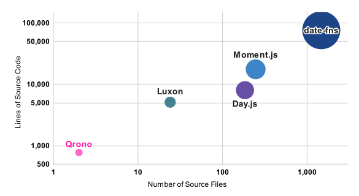

#  [Qrono](https://qronojs.dev/) — Small. Complete. Deterministic. JavaScript date-time.

_**4kB** JavaScript date library with **100+ APIs** and **strict DST guarantees**. Designed for **single-timezone** applications._

[![MIT License][image-license]][url-license]
[![CodeQL][image-codeql]][url-codeql]
[![NPM version][image-npm-version]][url-npm]
[![NPM downloads][image-downloads]][url-downloads]
[![gzip size][image-size]][url-size]

```js
import { qrono } from 'qrono'

// America/New_York — DST ends
qrono({ localtime: true }, '2026-03-29 01:30').plus({ hour: 1 }) // DST-safe
// UTC first
qrono('2026-08-31 12:34').toString() === '2026-08-31T12:34.000Z'
// Flexible APIs
qrono('2026-08-31 12:34') < qrono('2026-09-30 12:34')
const today = qrono.date('2021-08-31')
const tomorrow = qrono.date(today + 1)
tommorow - today === 1
```

[🌐 Website<sup> ↗</sup>](https://qronojs.dev/) \| [🎨 Design philosophy](#design-philosophy-) \| [📥 Getting started](#getting-started-) \| [🚀 Quick tour](#quick-tour-) \| [🌏 License](#license-)

---

## Design Philosophy 🎨

#### 🔐 **Immutable, Intuitive and Chainable**
- All operations return new instances for safe, predictable data and intuitive API.
- Covers the majority of common use cases.

#### 🔷 **TypeScript Ready**
- Full TypeScript definitions included for type-safe development.
- Designed to work seamlessly in both server-side and browser-side JavaScript environments.

#### ⚡ **Minimal and Focused**
- Pure JavaScript with zero dependencies.
- Lightweight (**4kB**) with **100+** APIs through focused design.

#### 🌍 **UTC-first with Local Time Support**
- Supports UTC by default and the environment's local time zone.
- Locale-agnostic design delegates localization to the [ECMAScript Internationalization API](https://402.ecma-international.org/#overview).

#### 🕐 **Strict DST Handling**
- Unique DST-aware APIs that no other library provides.
- Explicit handling of ambiguous daylight saving time transitions through dedicated APIs.

#### ✅ **ISO 8601 Compliant**
- Fully compliant with the [ISO 8601](https://www.iso.org/obp/ui/#iso:std:iso:8601:-1:ed-1:v1:en) standard for reliable date-time exchange and interoperability.

### Alternatives

- **[Moment.js](https://momentjs.com/)**  
  A widely used library that was once the de facto standard for date-time handling in JavaScript. It entered maintenance mode in 2020.  
  Its mutable API design can lead to unintended side effects and bugs. Most modern date-time libraries introduced below are designed to be immutable.

- **[Luxon](https://moment.github.io/luxon/)**  
  An immutable, feature-rich library created by the maintainers of Moment.js. It provides comprehensive timezone and formatting support.  
  By default, it operates in the system’s local time zone and does not provide strict disambiguation for ambiguous local times.  
  Its documentation clearly explains how ambiguous times are handled.

- **[Day.js](https://day.js.org/)**  
  A small, Moment.js-compatible library with a large GitHub following, increasingly considered a de facto standard.  
  Approximately 3kB with 30+ core APIs. Timezone, locale support, and additional functionality require plugins.  
  Currently preparing a major version upgrade.

- **[date-fns](https://date-fns.org/)**  
  Provides 200+ pure functions for manipulating JavaScript `Date` objects. Implemented in TypeScript and fully tree-shakeable.  
  Because it builds directly on the native `Date` object, it inherits limitations such as mutability and zero-based months.

None of these libraries provide dedicated APIs for strict DST transition handling.  
Qrono addresses this gap with a balanced and pragmatic approach.

- **[The ECMA TC39 Temporal Proposal](https://tc39.es/proposal-temporal/docs/index.html)**  
  A proposed ECMAScript API that may become a future standard. Temporal (TC39) defines a comprehensive and rigorous date-time model, including numerous classes such as `Instant`, `Duration`, and `ZonedDateTime`, and provides a complete API covering locale handling and the IANA time zone database. While this design ensures correctness and precision across a wide range of use cases, its breadth and strictness can make it heavyweight and difficult to grasp for developers who simply need to handle date and time operations.

In contrast, Qrono focuses on delivering the simplest possible API surface while remaining practical for real-world applications, prioritizing clarity and usability over exhaustive completeness.

### Repository Size Comparison

[](docs/public/comparison-repo-size.svg)

This comparison shows that **Qrono stands out for its small codebase** among other libraries. Its compact size reflects a strong focus on minimalism and efficiency, making it well suited for situations where bundle size and simplicity are important.

For many of the other libraries, their larger size is due to the fact that a significant portion of the codebase is dedicated to supporting a wide range of locales. Meanwhile, the larger size of date-fns is intentional and not a drawback. It is designed with tree-shaking in mind, so unused functions are removed at build time, and its API is intentionally fine-grained and verbose to provide clarity and flexibility. The size difference therefore represents a difference in design philosophy, not a measure of overall quality.

### Supporting Only the Local Time of the Execution Environment

When handling time in a globally accessible web application, careful consideration is required for local time.

In general, the server does not know the user’s actual time zone or the time zone of the client environment (OS).
If the system needs to be aware of the user’s time zone, an application-level mechanism to manage time zones becomes necessary. In practice, however, the user’s time zone is usually assumed to be the same as the client environment’s (OS) time zone.

For example, a user who resides in Japan may start using the application in the United States. If the user changes the OS time zone to match the local time in the United States, this will be done automatically in most cases, such as when the environment is a smart device; the client environment's time zone will differ from the one that is managed in the server. Considering the large number of such edge cases, it is impractical for a server-side application to manage each user's intended time zone in a database-like manner.

For this reason, to keep the system design simple, the server should avoid managing user-specific time zones. Instead, the server should store and handle time exclusively in UTC. All time values should be transmitted to clients in UTC (typically as ISO 8601–formatted strings), and converting them into local time should be the responsibility of the client.

Even when support for multiple locales is required, storing time data in UTC is usually sufficient. In most cases, locale-specific formatting can be handled entirely on the client side by using the [ECMAScript Internationalization API](https://402.ecma-international.org/#overview).

One important caveat of this design is that the time zone database of the client environment (OS) must be properly maintained. Daylight saving time rules — for example, in Brazil — may change from year to year, and time zone definitions themselves are determined by laws that are frequently revised. This means that the underlying time zone database must be kept up to date.

If the application is used in a closed or unmanaged environment where such updates cannot be applied due to special constraints, the approach described above may be insufficient.

In most typical environments, this requirement is satisfied automatically through the operating system’s regular update mechanisms, so it does not pose a practical issue for the majority of applications. However, if the application is used in a closed or unmanaged environment where such updates cannot be applied due to special constraints, the approach described above may be insufficient.

Considering these factors, **Qrono** is deliberately designed to forgo support for multiple time zones in order to achieve greater overall benefits, such as a **small code base and easy handling of daylight saving time transitions**.

### About Daylight Saving Time

Qrono is the only JavaScript date-time library with dedicated APIs for DST handling (`hasDstInYear()`, `isInDst()`, `isDstTransitionDay()`, `minutesInDay()`).

JavaScript's `Date` object can behave in non-intuitive ways when handling daylight saving time transitions.

For example, see the following scenario in the Central Standard Time (CST) zone of the USA:

```javascript
const date = new Date('2021-03-14T03:00:00.000')
date.setMilliseconds(-1) // results 2021-03-14 03:59:59.999 CST
```

On March 14, 2021, daylight saving time begins. The time jumps directly from `2021-03-14 01:59:59 CST` to `2021-03-14 03:00:00 CST`.

In this example, subtracting 1 millisecond from `2021-03-14 03:00:00.000 CST` results in `2021-03-14 03:59:59.999 CST`. This appears to be a simple subtraction of 1 millisecond, but it actually advances the time by 1 hour.

This behavior is not a bug but a result of strictly following the [ECMAScript specification](https://262.ecma-international.org/11.0/#sec-local-time-zone-adjustment).

Additionally, a `Date` object created from a duplicated time during daylight saving time (DST) transition always refers to the time before DST ends. In other words, there is no simple way to obtain a `Date` object that refers to the UTC time **after** the end of DST from a duplicated time.

**Qrono** addresses these issues by providing a more understandable approach to handling such transitions.

## Getting started 📥

```sh
npm  install qrono        # for npm
deno add jsr:@urin/qrono  # for Deno
bunx jsr add @urin/qrono  # for Bun
pnpm add     @urin/qrono  # for pnpm
yarn add     @urin/qrono  # for Yarn
```

```html
<!-- for Browser -->
<script src="path/to/qrono.min.js"></script>
<!-- from UNPKG -->
<script src="https://unpkg.com/qrono/dist/qrono.min.js"></script>
```

```js
// as module
import { qrono } from 'qrono'
// or CommonJS
const { qrono } = require('qrono')
```

## Quick tour 🚀

Visit [official website<sup> ↗</sup>](https://qronojs.dev/) for complete documentation.

- Factory
  - [qrono(...args)](https://qronojs.dev/api/#qrono) <sub></sub> <sup>14 overloads</sup>
  - [qrono.date(...args)](https://qronojs.dev/api/#qrono-date) <sub></sub> <sup>7 overloads</sup>
- Conversion
  - [.toString()](https://qronojs.dev/api/#tostring) <sub></sub> <sub></sub>
  - [.numeric()](https://qronojs.dev/api/#numeric) <sub></sub> <sub></sub>
  - [.valueOf()](https://qronojs.dev/api/#valueof) <sub></sub> <sub></sub>
  - [.toArray()](https://qronojs.dev/api/#toarray) <sub></sub> <sub></sub>
  - [.toObject()](https://qronojs.dev/api/#toobject) <sub></sub> <sub></sub>
  - [.nativeDate()](https://qronojs.dev/api/#nativedate) <sub></sub> <sub></sub>
  - [.toDate()](https://qronojs.dev/api/#todate) <sub></sub>
  - [.toDatetime()](https://qronojs.dev/api/#todatetime) <sub></sub>
- Constants
  - [qrono.monday](https://qronojs.dev/api/#day-constants) <sub></sub>
  - [qrono.tuesday](https://qronojs.dev/api/#day-constants) <sub></sub>
  - [qrono.wednesday](https://qronojs.dev/api/#day-constants) <sub></sub>
  - [qrono.thursday](https://qronojs.dev/api/#day-constants) <sub></sub>
  - [qrono.friday](https://qronojs.dev/api/#day-constants) <sub></sub>
  - [qrono.saturday](https://qronojs.dev/api/#day-constants) <sub></sub>
  - [qrono.sunday](https://qronojs.dev/api/#day-constants) <sub></sub>
- Accessors
  - [.year()](https://qronojs.dev/api/#year) <sub></sub> <sup>2 overloads</sup> <sub></sub> <sup>2 overloads</sup>
  - [.month()](https://qronojs.dev/api/#month) <sub></sub> <sup>2 overloads</sup> <sub></sub> <sup>2 overloads</sup>
  - [.day()](https://qronojs.dev/api/#day) <sub></sub> <sup>2 overloads</sup> <sub></sub> <sup>2 overloads</sup>
  - [.hour()](https://qronojs.dev/api/#hour) <sub></sub> <sup>2 overloads</sup>
  - [.minute()](https://qronojs.dev/api/#minute) <sub></sub> <sup>2 overloads</sup>
  - [.second()](https://qronojs.dev/api/#second) <sub></sub> <sup>2 overloads</sup>
  - [.millisecond()](https://qronojs.dev/api/#millisecond) <sub></sub> <sup>2 overloads</sup>
  - [.offset()](https://qronojs.dev/api/#offset) <sub></sub>
- Context
  - [qrono.context()](https://qronojs.dev/api/#default-context) <sub></sub> <sup>2 overloads</sup>
  - [qrono.asUtc()](https://qronojs.dev/api/#default-asutc) <sub></sub>
  - [qrono.asLocaltime()](https://qronojs.dev/api/#default-aslocaltime) <sub></sub>
  - [qrono.localtime()](https://qronojs.dev/api/#default-localtime) <sub></sub> <sup>2 overloads</sup>
  - [.context()](https://qronojs.dev/api/#context) <sub></sub> <sup>2 overloads</sup>
  - [.localtime()](https://qronojs.dev/api/#localtime) <sub></sub> <sup>2 overloads</sup>
  - [.interpretAsDst()](https://qronojs.dev/api/#interpretasdst) <sub></sub>
  - [.asUtc()](https://qronojs.dev/api/#asutc) <sub></sub>
  - [.asLocaltime()](https://qronojs.dev/api/#aslocaltime) <sub></sub>
- Calculation
  - [.plus(duration)](https://qronojs.dev/api/#plus) <sub></sub> <sup>4 overloads</sup> <sub></sub> <sup>4 overloads</sup>
  - [.minus(duration)](https://qronojs.dev/api/#minus) <sub></sub> <sup>4 overloads</sup> <sub></sub> <sup>4 overloads</sup>
  - [.valid()](https://qronojs.dev/api/#valid) <sub></sub> <sub></sub>
- Comparison
  - [.isSame(other)](https://qronojs.dev/api/#issame) <sub></sub> <sup>3 overloads</sup> <sub></sub> <sup>3 overloads</sup>
  - [.isBefore(other)](https://qronojs.dev/api/#isbefore) <sub></sub> <sup>3 overloads</sup> <sub></sub> <sup>3 overloads</sup>
  - [.isAfter(other)](https://qronojs.dev/api/#isafter) <sub></sub> <sup>3 overloads</sup> <sub></sub> <sup>3 overloads</sup>
  - [.isSameOrBefore(other)](https://qronojs.dev/api/#issameorbefore) <sub></sub> <sup>3 overloads</sup> <sub></sub> <sup>3 overloads</sup>
  - [.isSameOrAfter(other)](https://qronojs.dev/api/#issameorafter) <sub></sub> <sup>3 overloads</sup> <sub></sub> <sup>3 overloads</sup>
  - [.isBetween(start, end)](https://qronojs.dev/api/#isbetween) <sub></sub> <sup>3 overloads</sup> <sub></sub> <sup>3 overloads</sup>
- Time Unit Boundary
  - [.startOfYear()](https://qronojs.dev/api/#startofyear) <sub></sub> <sub></sub>
  - [.startOfMonth()](https://qronojs.dev/api/#startofmonth) <sub></sub> <sub></sub>
  - [.startOfDay()](https://qronojs.dev/api/#startofday) <sub></sub> <sub></sub>
  - [.startOfHour()](https://qronojs.dev/api/#startofhour) <sub></sub>
  - [.startOfMinute()](https://qronojs.dev/api/#startofminute) <sub></sub>
  - [.startOfSecond()](https://qronojs.dev/api/#startofsecond) <sub></sub>
  - [.endOfYear()](https://qronojs.dev/api/#endofyear) <sub></sub>
  - [.endOfMonth()](https://qronojs.dev/api/#endofmonth) <sub></sub>
- Date Information
  - [.dayOfWeek()](https://qronojs.dev/api/#dayofweek) <sub></sub> <sub></sub>
  - [.dayOfYear()](https://qronojs.dev/api/#dayofyear) <sub></sub> <sub></sub>
  - [.weekOfYear()](https://qronojs.dev/api/#weekofyear) <sub></sub> <sub></sub>
  - [.yearOfWeek()](https://qronojs.dev/api/#yearofweek) <sub></sub> <sub></sub>
  - [.isLeapYear()](https://qronojs.dev/api/#isleapyear) <sub></sub> <sub></sub>
  - [.daysInMonth()](https://qronojs.dev/api/#daysinmonth) <sub></sub> <sub></sub>
  - [.daysInYear()](https://qronojs.dev/api/#daysinyear) <sub></sub> <sub></sub>
  - [.weeksInYear()](https://qronojs.dev/api/#weeksinyear) <sub></sub> <sub></sub>
- Daylight Saving Time
  - [.hasDstInYear()](https://qronojs.dev/api/#hasdstinyear) <sub></sub> <sub></sub>
  - [.isInDst()](https://qronojs.dev/api/#isindst) <sub></sub> <sub></sub>
  - [.isDstTransitionDay()](https://qronojs.dev/api/#isdsttransitionday) <sub></sub> <sub></sub>
  - [.minutesInDay()](https://qronojs.dev/api/#minutesinday) <sub></sub> <sub></sub>

### Construction

```js
// now
qrono()
// from various types of arguments
qrono('2022-12-31') // => 2022-12-31T00:00:00.000Z
qrono(new Date())
// the following are the same 2022-12-31T15:23:11.321Z
qrono('2022-12-31 15:23:11.321')
qrono(1672500191321)
qrono(2022, 12, 31, 15, 23, 11, 321)
qrono([2022, 12, 31, 15, 23, 11, 321])
qrono({ year: 2022, month: 12, day: 31, hour: 15, minute: 23, second: 11, millisecond: 321 })
```

### Accessor

```js
const time = qrono(2022, 12, 31, 15, 23, 11, 321)
time.year()        // => 2022
time.month()       // => 12
time.day()         // => 31
time.hour()        // => 15
time.minute()      // => 23
time.second()      // => 11
time.millisecond() // => 321

time.second(0) // => returns new Qrono instance
```

### Time zone

```js
// UTC as default
qrono('2022-12-31 15:23:11.321').toString() // => "2022-12-31T15:23:11.321Z"
// set default to local time
qrono.asLocaltime()
qrono('2022-12-31 15:23:11.321').toString()     // => "2022-12-31T15:23:11.321-04:00"
qrono('2022-12-31 15:23:11.321').asUtc().hour() // => 11 as UTC
qrono('2022-12-31 15:23:11.321').hour()         // => 15 as local time
```

### Conversion

```js
qrono('2000-01-01').numeric() // => 946,684,800,000 milliseconds from UNIX epoch
  === +qrono('2000-01-01')    // => true
const time = qrono('2000-01-02 03:04:05.006')
time.toObject()   // => { year: 2000, month: 1, day: 2, hour: 3, minute: 4, second: 5, millisecond: 6 }
time.toArray()    // => [2000, 1, 2, 3, 4, 5, 6]
time.nativeDate() // => JavaScript native `Date` instance
```

### Calculation

```js
qrono('2000-01-01 01:00:00.000') - qrono('2000-01-01') // => 3,600,000 milliseconds = 1 hour
qrono('2000-01-01 01:00:00.000') < qrono('2000-01-01') // => false
qrono('2000-01-01').plus(7200000).minus(3600000)       // => 2000-01-01T01:00:00.000Z
// In operations using Object, `year`, `month`, and `day` are calculated literally.
// For example, adding one month at the end of a month results in the end of the following month.
// `hour`, `minute`, `second`, and `millisecond` are treated as a duration in calculations.
qrono('2000-01-01').minus({ hour: 1, minute: 30 })     // => 1999-12-31T22:30:00.000Z
qrono('2020-02-29').plus({ year: 1 })                  // => 2021-02-28T00:00:00.000Z
qrono('2021-12-31').minus({ month: 1 })                // => 2021-11-30T00:00:00.000Z

const today = qrono()
const yesterday = today.minus({ day: 1 })
const tomorrow = today.plus({ day: 1 })
today.isBetween(yesterday, tomorrow) // => true
```

### Short-hands

```js
const time = qrono('2000-01-02 03:04:05.006')
time.startOfYear()   // => 2000-01-01T00:00:00.000Z
time.startOfMonth()  // => 2000-01-01T00:00:00.000Z
time.startOfDay()    // => 2000-01-02T00:00:00.000Z
time.startOfHour()   // => 2000-01-02T03:00:00.000Z
time.startOfMinute() // => 2000-01-02T03:04:00.000Z
time.startOfSecond() // => 2000-01-02T03:04:05.000Z
time.dayOfWeek()     // => 7 === qrono.sunday
time.dayOfYear()     // => 2
time.isLeapYear()    // => true
time.daysInMonth()   // => 31
time.daysInYear()    // => 366
// ISO week number. See https://en.wikipedia.org/wiki/ISO_week_date
time.weeksInYear()   // => 52
time.weekOfYear()    // => 52
time.yearOfWeek()    // => 1999
// Daylight saving time stuff that is meaningful in case of local time
const localtime = time.asLocaltime()
localtime.hasDstInYear()
localtime.isInDst()
localtime.isDstTransitionDay()
localtime.minutesInDay()
```

### QronoDate

`qrono.date(...)` returns a `QronoDate` instance with only date information.

Methods of `QronoDate` are almost compatible with those of `Qrono`.

```js
qrono.date('2000-01-02').toString()       // => "2000-01-02"
qrono('2000-01-02 23:04:05.006').toDate() // => QronoDate instance 2000-01-02
qrono.date('2000-01-02').numeric()        // => 10958 days from UNIX epoch
```

## License 🌏

[MIT][url-license]

Copyright (c) 2021 [Urin](https://github.com/urin)


<!-- Reference -->
[image-codeql]: https://github.com/urin/qrono/actions/workflows/github-code-scanning/codeql/badge.svg
[url-codeql]: https://github.com/urin/qrono/actions/workflows/github-code-scanning/codeql

[image-license]: https://img.shields.io/badge/license-MIT-blue.svg?style=flat
[url-license]: LICENSE

[image-npm-version]: https://img.shields.io/npm/v/qrono.svg?style=flat
[url-npm]: https://npmjs.org/package/qrono

[image-downloads]: https://img.shields.io/endpoint?url=https://raw.githubusercontent.com/urin/my-actions/main/badges/downloads.json
[url-downloads]: https://npmcharts.com/compare/qrono?minimal=true

[image-size]: https://img.badgesize.io/https://unpkg.com/qrono/dist/qrono.min.js?compression=gzip&color=blue
[url-size]: https://unpkg.com/qrono/dist/qrono.min.js
